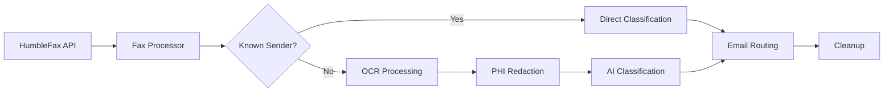

# FaxSort 📠🤖

**AI-powered fax classification and routing system for healthcare and business workflows**

FaxSort is an automated fax processing service that receives faxes via HumbleFax API, uses OCR and AI to classify document types, and intelligently routes them to the appropriate recipients via email. Originally built for internal use at a healthcare practice, it's now open sourced for anyone who needs intelligent fax handling.

## ✨ Features

- **🔄 Automated Polling**: Continuously monitors HumbleFax for incoming faxes
- **👁️ OCR Processing**: Extracts text from TIFF images using Tesseract
- **🧠 AI Classification**: Uses Anthropic's Claude to categorize documents with custom categories
- **🔒 HIPAA Compliance**: Optional PHI redaction using Microsoft Presidio
- **📧 Smart Routing**: Automatically emails classified faxes to designated recipients
- **⚡ Known Sender Fast-Track**: Direct routing for pre-configured senders
- **🔧 Highly Configurable**: Extensive environment variable configuration
- **📊 Health Monitoring**: Built-in health check endpoint
- **🧹 Auto Cleanup**: Automatic cleanup of temporary files

## 🏥 Perfect For

- **Healthcare Practices**: Route lab results, referrals, prescriptions, and medical records
- **Legal Offices**: Classify and distribute contracts, court documents, and correspondence  
- **Insurance Companies**: Sort claims, authorizations, and policy documents
- **Any Business**: That receives high volumes of faxes requiring manual sorting

## 🚀 Quick Start

### Prerequisites

- Python 3.11+
- Tesseract OCR
- HumbleFax account
- Anthropic API key
- Office 365 email account (for routing)

### Installation

1. **Clone the repository**
   ```bash
   git clone https://github.com/yourusername/faxSort.git
   cd faxSort
   ```

2. **Install dependencies**
   ```bash
   pip install -r requirements.txt
   ```

3. **Install Tesseract OCR**
   ```bash
   # Ubuntu/Debian
   sudo apt-get install tesseract-ocr
   
   # macOS
   brew install tesseract
   
   # Windows
   # Download from: https://github.com/UB-Mannheim/tesseract/wiki
   ```

4. **Download spaCy model**
   ```bash
   python -m spacy download en_core_web_md
   ```

5. **Configure environment variables**
   ```bash
   cp .env.example .env
   # Edit .env with your configuration (see Configuration section)
   ```

6. **Run the service**
   ```bash
   cd src
   python main.py
   ```

## ⚙️ Configuration

FaxSort is configured entirely through environment variables. Copy `.env.example` to `.env` and customize:

### Required Variables

```env
# API Keys
ANTHROPIC_API_KEY=your_anthropic_key_here
HUMBLE_FAX_ACCESS_KEY=your_humblefax_access_key
HUMBLE_FAX_SECRET_KEY=your_humblefax_secret_key
FAX_TO_NUMBER=your_fax_number

# Document Categories (comma-separated)
CLASSIFICATION_CATEGORIES=Medical Records Request,Pathology Report,Prior Authorization,Referral,Prescription Refill,Insurance Document,Uncategorized

# Email Configuration
SMTP_USERNAME=your.email@yourdomain.com
SMTP_PASSWORD=your_password_or_app_password
DEFAULT_FROM_EMAIL=your.email@yourdomain.com

# Email Routing (DocumentType:email@domain.com)
EMAIL_MAPPINGS=Medical Records Request:medrec@example.com,Pathology Report:path@example.com,Prior Authorization:auth@example.com
```

### Optional Variables

```env
# HIPAA Compliance
HIPAA_MODE=false  # Set to 'true' to enable PHI redaction

# Known Sender Mappings (bypass OCR/AI classification)
SENDER_MAPPINGS=LabCorp:Lab Results,Quest Diagnostics:Lab Results

# Polling Settings
POLLING_RATE=60  # Seconds between polls

# Custom Classification Rules
KEYWORD_RULES=If you see Humira or Dupixent, classify as Biologics
```

## 🔧 How It Works



1. **Polling**: Service polls HumbleFax API every 60 seconds (configurable)
2. **Download**: Downloads faxes as both TIFF (for OCR) and PDF (for email attachment)
3. **Classification**: 
   - Known senders get classified immediately based on sender mappings
   - Unknown senders go through OCR → PHI redaction (if enabled) → AI classification
4. **Routing**: Classified faxes are emailed to appropriate recipients based on document type
5. **Cleanup**: Temporary files are automatically cleaned up after successful processing

## 📋 Document Classification

The AI classification system is highly customizable:

### Built-in Intelligence
- **Keyword Rules**: Define specific keywords that trigger certain classifications
- **Sender Mappings**: Bypass classification for known, trusted senders
- **Fallback Handling**: Unclassifiable documents default to "Uncategorized"

### Example Categories for Healthcare
- Medical Records Request
- Pathology Report  
- Prior Authorization
- Referral
- Prescription Refill
- Lab Results
- Insurance Document
- Biologics (medication-specific)

## 🔒 HIPAA Compliance

Enable HIPAA mode to automatically redact PHI before sending to external AI services:

```env
HIPAA_MODE=true
```

When enabled, FaxSort uses Microsoft Presidio to identify and redact:
- Names, addresses, phone numbers
- Social Security Numbers
- Medical record numbers
- Dates and other identifying information

## 📊 Monitoring

### Health Check
```bash
curl http://localhost:8000/health
```

Returns:
```json
{
  "status": "healthy",
  "timestamp": "2025-01-15T10:30:00",
  "processor_status": "running"
}
```

### Logging
Comprehensive logging shows:
- Fax polling activity
- Classification results
- Email delivery status
- Error handling and retries

## 🐳 Docker Deployment

Coming soon! Docker support is planned for easier deployment.

## 🤝 Contributing

FaxSort was built for internal use and is now open sourced to help others solve similar challenges. Contributions are welcome!

### Development Setup
1. Fork the repository
2. Create a virtual environment: `python -m venv venv`
3. Install dev dependencies: `pip install -r requirements.txt`
4. Install pre-commit hooks: `pre-commit install`
5. Make your changes and submit a PR

### Areas for Contribution
- Docker containerization
- Additional OCR engines
- More classification providers (OpenAI, local models)
- Web dashboard for monitoring
- Additional email providers
- Performance optimizations

## 🛡️ Security Considerations

- **Credentials**: Store all API keys and passwords securely
- **PHI Handling**: Enable HIPAA mode when processing medical documents
- **Network Security**: Run behind a firewall, consider VPN for production
- **File Storage**: Temporary files are cleaned up automatically
- **Logging**: No PHI is logged when HIPAA mode is enabled

## 📝 License

MIT License - see [LICENSE](LICENSE) file for details.


## 📞 Support

This project is provided as-is. For bugs and feature requests, please open a GitHub issue.

---

**Made with ❤️ for healthcare workers and anyone drowning in fax paperwork**
